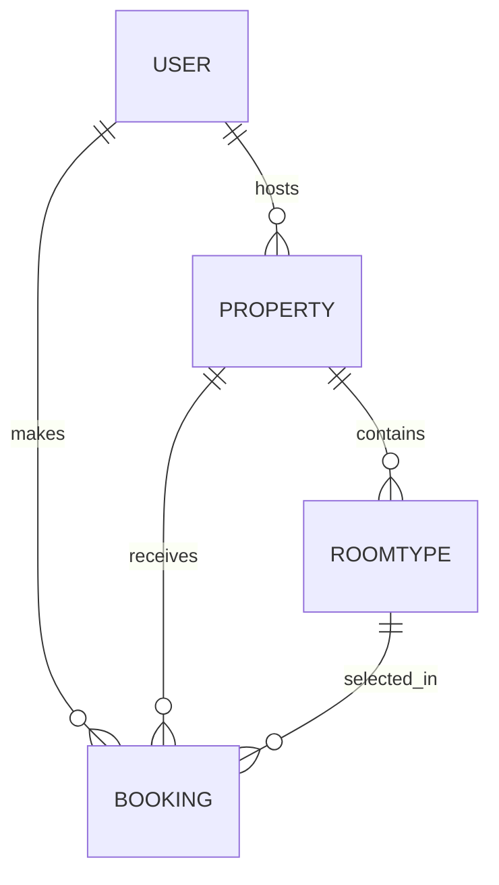

# LuxeStay Project Report (Advanced)

## 1. Executive Summary
LuxeStay is a high-end, premium property rental platform designed to provide a seamless experience for both property hosts and guests. The platform focuses on luxury listings, flexible pricing models, and a modern, high-performance user interface. Built with scalability in mind, it utilizes a decoupled architecture with a Django REST Framework backend and a Next.js frontend, now featuring advanced role-based access control (RBAC) and profile management.

---

## 2. Technical Architecture

### 2.1 Backend (Django REST Framework)
- **Framework**: Django 6.0+ with Django REST Framework (DRF).
- **Authentication**: JWT (JSON Web Tokens) with custom payload enrichment (Role, is_staff, is_superuser).
- **Database**: **MySQL 8.0 / MariaDB** (Production) integrated via **PyMySQL**.
- **Environment Management**: Robust configuration using `python-dotenv`.
- **Key Modules**: 
  - `accounts`: Advanced RBAC for Normal Users, Hosts, and Admins with mandatory profile verification.
  - `properties`: Advanced booking engine with multi-tiered pricing and real-time availability management.

### 2.2 Frontend (Next.js)
- **Framework**: Next.js 14/15+ (App Router) for Server-Side Rendering (SSR).
- **Styling**: Vanilla CSS & Tailwind CSS with a premium design system.
- **State Management**: React Context API & Hooks with persistent role-based routing.
- **Visuals**: Dynamic hero backgrounds, glassmorphism components, and smooth interactive animations.

---

## 3. Core Features

### 3.1 Flexible Property Pricing Matrix
LuxeStay implements a unique 3D pricing matrix, allowing hosts to toggle availability and set rates for:
- **Nightly**: Short-term stay calculations.
- **Daily**: Day-use rental logic.
- **Monthly**: Long-term lease automation.

### 3.2 Tiered Room Categorization
Properties support multiple room types with dynamic pricing overrides:
- **Dormitory**: High-density, budget-friendly shared spaces.
- **Double**: Standard luxury accommodation.
- **Single**: Premium privacy-focused units.

### 3.3 Intelligent Booking Engine
- **Check-in/Out Logic**: Automatic calculation of duration and cost.
- **Room Selection**: Real-time availability checks per category.
- **Availability Toggle**: Instant platform-wide visibility control for hosts via dedicated dashboard.

### 3.4 Profile & Identity Management (New)
- **Unified Profile Edit**: All users can update their Full Name, Email, Phone Number, and Address.
- **Registration Verification**: Mandatory identity fields (Full Name, Phone) for all account types to ensure platform trust.

---

## 4. System Schema & Data Flow

### 4.1 Key Data Models
- **User**: Custom user model with `role` (NORMAL, HOST, ADMIN), `phone_number`, and `full_name`.
- **Property**: Core entity storing location data, global pricing, and availability flags.
- **RoomType**: Relational model providing granular pricing overrides for specific property sections.
- **Booking**: Transactional record linking users, properties, and specific room categories.

---

## 5. API Ecosystem (RESTful Endpoints)

| Category | Endpoint | Method | Security | Description |
|----------|----------|--------|----------|-------------|
| **Auth** | `/api/auth/register/` | `POST` | Public | User onboarding with verification |
| **Auth** | `/api/auth/login/` | `POST` | Public | JWT issuance + User metadata |
| **Auth** | `/api/auth/profile/` | `GET/PATCH` | Auth | Profile management |
| **Properties** | `/api/properties/` | `GET/POST` | Mixed | List or curate properties |
| **Admin** | `/api/auth/users/` | `GET/PATCH/DELETE` | Admin | Full system user audit and management |

---

## 6. Deployment & DevOps

### 6.1 Containerization (Docker)
The project is fully containerized for consistent development and production environments.
- **`backend/Dockerfile`**: Optimized Python-slim image.
- **`frontend/Dockerfile`**: Multi-stage build for minimal production bundle.
- **`docker-compose.yml`**: Orchestrates MySQL, Backend, and Frontend services.

---

## 7. Admin & Host Management

### 7.1 Advanced Host Dashboard
Hosts have exclusive access to `/dashboard/host` to manage their property visibility and view guest bookings with real-time status updates.

### 7.2 Professional Admin Control (Enhanced)
Admins can perform system-wide audits via `/dashboard/admin`, featuring:
- **User Management**: Real-time Edit and Delete functionality for all accounts.
- **Role Correction**: Capability to promote/demote users between NORMAL, HOST, and ADMIN status.
- **Data Transparency**: Enhanced table views including Phone Numbers and Email IDs for all system users.

---

## 8. Recent Milestone Updates (May 2026)
- **Role Standardization**: Successfully rebranded 'Owner' role to **'Host'** for industry-standard terminology.
- **Profile Management**: Launched the **Profile Edit** feature allowing users to manage their own identity data.
- **Admin Overhaul**: Implemented full CRUD operations on the Admin User Management dashboard.
- **Data Integrity**: Enforced mandatory registration fields (Full Name, Phone) for enhanced guest-host trust.
- **JWT Enrichment**: Upgraded authentication tokens to carry granular role and permission flags.

---
*LuxeStay Technical Report v3.0 | Last Updated: 2026-05-07*

